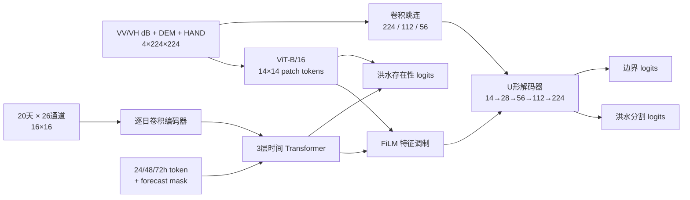

# 洪析先知：GFF 未来洪水范围预测

本项目使用 Global Flood Forecasting（GFF）数据，根据灾前 Sentinel-1 SAR、地形以及发布时刻之前的气象水文信息，预测目标地区未来 24、48 或 72 小时的暂态洪水范围。

当前主模型为 `GFFViTHorizonFormer`：空间分支采用 ImageNet 预训练 ViT-B/16 和 U 形卷积解码器，时间分支采用气象水文 Transformer，并通过预见期条件和特征调制融合两类信息。

> GFF 提供的是再分析数据，不是带历史预报发布时间的业务预报归档。本项目的 `causal` 模式会屏蔽目标时刻前最后 1/2/3 天的再分析值，以模拟 24/48/72h 发布时刻。实际部署时仍需接入发布时刻真正可用的 ECMWF/GloFAS 预报并重新训练或微调。

## 1. 任务定义

对于每个空间瓦片和预见期 `h ∈ {1, 2, 3}`，模型学习：

```text
灾前 VV/VH SAR + DEM + HAND + 截止发布时刻可见的20天气象水文序列
                                ↓
             预测 h×24 小时后的 flooded 类范围
```

- 目标：GFF floodmap 中的类别 2（`flooded`）。
- 非目标：背景和永久水体；永久水体不计作新增/暂态洪水。
- 模型输入不包含目标时刻 Sentinel-1 影像。
- 真实 floodmap 只在训练和评估时作为标签。
- 每个地理瓦片复制为 24h、48h、72h 三个训练样本。

## 2. 数据来源与目录格式

- [GFF v3 数据记录](https://zenodo.org/records/14184289)
- [数据集 DOI：10.5281/zenodo.14184289](https://doi.org/10.5281/zenodo.14184289)
- [GFF 配套代码](https://github.com/Multihuntr/gff)

当前模型只需要 `base`、`s1`、`dem`、`hand`、`era5` 和 `glofas` 六个组件：

```powershell
conda run -n daily --no-capture-output python scripts\download_gff.py `
  --root data\gff `
  --components base glofas dem hand era5 s1 `
  --workers 24 `
  --part-mb 16
```

下载器支持断点续传、多连接下载、官方 MD5 校验和安全解压。解压后的核心目录为：

```text
data/gff/
├── downloads/                 # 下载的原始 ZIP 与分片
├── normalisation/             # 各数据源均值/标准差 CSV
├── partitions/                # 官方五折流域划分
│   ├── floodmap_partition_0.txt
│   └── ...
└── rois/                      # 每个洪水站点的空间与时间数据
    ├── <site>-meta.json
    ├── <visit_tiles>.gpkg
    ├── <floodmap>.tif
    ├── <key>-<pre_date>-s1.tif
    ├── <site>-dem-local.tif
    ├── <site>-hand.tif
    ├── <site>-era5.nc
    ├── <site>-era5-land.nc
    └── <key>_<post_date>.nc
```

### 2.1 原始文件含义

| 文件 | 格式 | 内容 |
|---|---|---|
| `*-meta.json` | JSON | 站点标识、日期和各组件文件名 |
| `*.gpkg` | GeoPackage | 瓦片边界及背景、永久水体、洪水像素计数 |
| floodmap | GeoTIFF | `0=背景`、`1=永久水体`、`2=暂态洪水` |
| `*-s1.tif` | 双波段 GeoTIFF | 灾前 Sentinel-1 VV、VH 线性后向散射 |
| `*-dem-local.tif` | GeoTIFF | 数字高程模型 DEM |
| `*-hand.tif` | GeoTIFF | Height Above Nearest Drainage |
| `*-era5.nc` | NetCDF | ERA5 日尺度气象变量 |
| `*-era5-land.nc` | NetCDF | ERA5-Land 地表与土壤变量 |
| `*.nc`（GloFAS） | NetCDF | 河流流量、径流和土壤含水相关变量 |

### 2.2 数据划分

代码直接使用 GFF 官方流域 fold，避免相邻区域同时出现在训练和测试中：

| 用途 | Fold | 当前完整实验规模 |
|---|---|---:|
| Train | 2、3、4 | 98,853 个瓦片 / 296,559 个瓦片×时效样本 |
| Validation | 1 | 固定 2,000 个瓦片 / 6,000 个样本 |
| Test | 0 | 固定 2,000 个瓦片 / 6,000 个样本 |

## 3. 模型实际接收的数据格式

`GFFFloodForecastDataset` 返回一个字典。单样本形状如下：

| 字段 | dtype / 形状 | 是否输入模型 | 含义 |
|---|---|---:|---|
| `spatial` | `float32 [4,224,224]` | 是 | `VV dB + VH dB + DEM + HAND` |
| `weather` | `float32 [20,26,16,16]` | 是 | 最近 20 天的 ERA5、ERA5-Land、GloFAS 上下文 |
| `horizon` | `int64 []` | 是 | `1/2/3`，对应 24/48/72h |
| `forecast_mask` | `bool [20]` | 是 | 指示被屏蔽的未来时段 |
| `target` | `float32 [1,224,224]` | 否 | 类别 2 的二值洪水标签 |
| `valid` | `float32 [1,224,224]` | 否 | 有效标签像素掩膜 |
| `boundary` | `float32 [1,224,224]` | 否 | 由标签通过 5×5 形态学运算生成的边界监督 |
| `presence` | `float32 []` | 否 | 瓦片内是否存在洪水 |
| `site` | `str` | 否 | GFF 站点名称 |
| `bounds` | `float64 [4]` | 否 | 瓦片投影坐标边界 |

批处理后，模型接口为：

```python
outputs = model(
    spatial,       # [B, 4, 224, 224]
    weather,       # [B, 20, 26, 16, 16]
    horizon,       # [B]
    forecast_mask, # [B, 20]
)
```

## 4. 输入预处理

### 4.1 Sentinel-1 SAR

当前正式配置使用 `sunet_db`，只保留 VV/VH 的物理 dB 表达，不加入 CLAHE 通道：

1. 将线性后向散射转换为 `10·log10(x)`；
2. VV 裁剪到 `[-25, 0] dB`；
3. VH 裁剪到 `[-32, -5] dB`；
4. 分别线性映射到 `[-1, 1]`。

因此当前空间输入固定为四通道，而不是 SU-Net 双视图实验中的六通道。

### 4.2 地形与气象水文数据

- DEM、HAND 按官方 fold 对应的均值和标准差标准化。
- 动态数据使用目标区域外扩 50 km 的上下文，重采样为 16×16。
- 所有动态变量按官方统计量标准化，并裁剪到 `[-6, 6]`。
- 26 个动态通道由 9 个 ERA5、14 个 ERA5-Land 和 3 个 GloFAS 变量组成。

主要变量包括气温、露点、降水、气压、风、四层土壤水分、辐射、雪水当量、潜在蒸发、河流流量、径流和土壤含水状态。

### 4.3 严格因果屏蔽

在 `forcing_mode: causal` 下：

- 24h：最后 1 天动态数据置为标准化后的气候均值 0；
- 48h：最后 2 天置 0；
- 72h：最后 3 天置 0。

`forecast_mask` 同时标记这些位置，时间 Transformer 可以区分真实历史观测与被屏蔽时段。

### 4.4 训练增强

训练集同步应用空间水平/垂直翻转、90°旋转，以及 SAR 增益和高斯噪声扰动。所有空间数据和标签采用相同几何变换。

## 5. 当前模型结构



### 5.1 空间分支

- Backbone：ImageNet 预训练 `ViT-B/16`。
- 输入：四通道 224×224 张量。
- Patch：16×16，形成 14×14 个空间 token。
- 预训练 RGB patch projection 通过通道均值扩展到四通道。
- 前 6 个 ViT block 冻结，后续 block 和任务头参与微调。
- 额外卷积路径保留 224、112、56 三个尺度的局部纹理和边界信息。

### 5.2 时间分支

- 每天的 `[26,16,16]` 动态场先由卷积编码器压缩为一个 128 维 token。
- 加入序列位置编码、观测/屏蔽状态 embedding 和预见期 embedding。
- 使用 3 层、4 头 Transformer Encoder 建模 20 天时序。
- horizon token 的最终表示作为全局气象水文上下文。

### 5.3 时空融合与解码

- 时间上下文通过 Feature-wise Linear Modulation（FiLM）调制 ViT token 和多级解码特征。
- U 形解码器逐级恢复 28、56、112、224 分辨率。
- 56/112/224 层分别融合卷积跳连，以恢复细窄和不规则洪水边界。
- 当前模型共约 89.17M 参数。

### 5.4 输出头

模型返回：

```python
{
    "segmentation": Tensor[B, 1, 224, 224],
    "boundary":     Tensor[B, 1, 224, 224],
    "presence":     Tensor[B],
}
```

最终洪水概率使用瓦片存在性进行软门控：

```text
P(flood pixel) = sigmoid(segmentation) × sigmoid(presence)
```

## 6. 训练目标与类别不平衡

训练时采用以下组合：

- 以 50% 正洪水瓦片为目标的分组重采样；同一瓦片的三个预见期一起采样。
- 分割损失：Focal-BCE（`pos_weight=4`、`gamma=2`）+ Dice。
- 边界损失：加权 BCE + Dice，权重 0.2。
- 洪水存在性 BCE，权重 0.15。
- AdamW、梯度累积和梯度裁剪。
- ViT backbone 学习率 `3e-6`，时间分支及任务头学习率 `3e-5`。

## 7. 推理与概率后处理

正式主结果使用原始门控概率和 validation 选择的阈值 0.30。项目同时保留两种可选后处理用于概率标定诊断：

| 配置 | 行为 |
|---|---|
| `configs/gff_vit_db_full_finetune.yaml` | 所有热度图直接使用原始概率，阈值 0.30 |
| `configs/gff_vit_db_full_finetune_per_heatmap.yaml` | 每张有效热度图独立 min–max，阈值 0.75 |
| `configs/gff_vit_db_full_finetune_adaptive.yaml` | `q99<0.01` 时归一化并用 0.75，否则保留原始概率并用 0.30 |

自适应模式的分流门限只在 validation 上选择。Test 不参与 checkpoint、阈值或分流门限选择。

## 8. 运行方式

项目使用已有 conda `daily` 环境：

```powershell
conda run -n daily python -m pip install -r requirements.txt
```

### 8.1 图形化推理界面

面向其他用户的完整数据目录、文件字段与校验方式见
[`docs/推理数据格式说明.md`](docs/推理数据格式说明.md)。标准版与自适应后处理版
正式权重作为 GitHub Release `inference-v1.0.0` 的附件发布；克隆仓库后请从 Release
下载到本地 `weights/` 目录：

```powershell
git clone https://github.com/worker1h/masterAI.git
```

```powershell
conda run -n daily --no-capture-output python scripts\run_inference_ui.py
```

界面依次选择训练产生的 `.pt/.pth/.ckpt` 权重和 GFF `rois` 目录中的
Sentinel-1 GeoTIFF（文件名通常以 `-s1.tif` 结尾），程序会自动识别 train/val/test
数据划分；再选择 24/48/72 小时
预测时效并点击“开始预测”。程序会根据该图像自动读取同一场景的 DEM、HAND、
ERA5、ERA5-Land 和 GloFAS 配套输入。一个场景含多个空间瓦片时，可用“场景瓦片”
切换预测区域。保存结果会同时生成组合预览 PNG、二值掩膜 PNG 和推理元数据 JSON。

### 8.2 数据审计与测试

```powershell
conda run -n daily --no-capture-output python scripts\audit_gff.py `
  --root data\gff `
  --output outputs\gff_data_audit.json

conda run -n daily --no-capture-output python -m unittest discover -s tests -v
```

### 8.2 完整 dB-only ViT 微调

完整配置从已选择的 dB-only 消融 checkpoint 初始化：

```powershell
powershell -ExecutionPolicy Bypass -File scripts\run_gff_vit_db_full_finetune.ps1
```

也可以手动运行：

```powershell
conda run -n daily --no-capture-output python -m src.train_gff `
  --config configs\gff_vit_db_full_finetune.yaml `
  --init-checkpoint outputs\gff_vit_ablation_db\best.pt
```

### 8.3 重新选择 checkpoint 和阈值

```powershell
conda run -n daily --no-capture-output python scripts\select_gff_checkpoint.py `
  --config configs\gff_vit_db_full_finetune.yaml `
  --checkpoints `
    outputs\gff_vit_db_full_finetune\epoch1.pt `
    outputs\gff_vit_db_full_finetune\epoch2.pt
```

### 8.4 生成预测图

```powershell
conda run -n daily --no-capture-output python scripts\predict_gff_example.py `
  --config configs\gff_vit_db_full_finetune.yaml `
  --checkpoint outputs\gff_vit_db_full_finetune\best.pt `
  --split test `
  --horizon 3 `
  --output outputs\gff_vit_db_full_finetune\prediction_72h.png
```

`--horizon 1/2/3` 分别表示 24/48/72h。

## 9. 主要代码位置

| 路径 | 作用 |
|---|---|
| `src/gff_data.py` | GFF 文件读取、预处理、因果屏蔽和样本组装 |
| `src/gff_model.py` | ViT 空间分支、时间 Transformer、FiLM 融合和多输出头 |
| `src/train_gff.py` | 损失、采样、训练、评估和概率后处理 |
| `scripts/download_gff.py` | 数据下载、校验与解压 |
| `scripts/select_gff_checkpoint.py` | validation checkpoint/阈值/分流门限选择 |
| `scripts/predict_gff_example.py` | 单样本预测和 TP/FP/FN 可视化 |
| `scripts/rank_gff_prediction_examples.py` | 固定测试样本的定性排序 |
| `configs/gff_vit_db_full_finetune.yaml` | 当前正式模型配置 |
| `configs/gff_vit_db_full_finetune_adaptive.yaml` | 低置信度自适应后处理配置 |
| `docs/GFF_SU-Net预处理消融实验报告.md` | 预处理、完整训练和后处理实验报告 |

模型 checkpoint、原始数据和实验输出默认位于 `outputs/`、`data/gff/`，不会提交到 Git 仓库。
